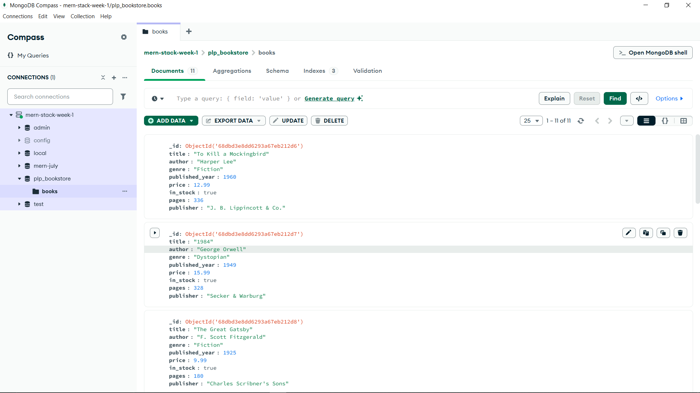
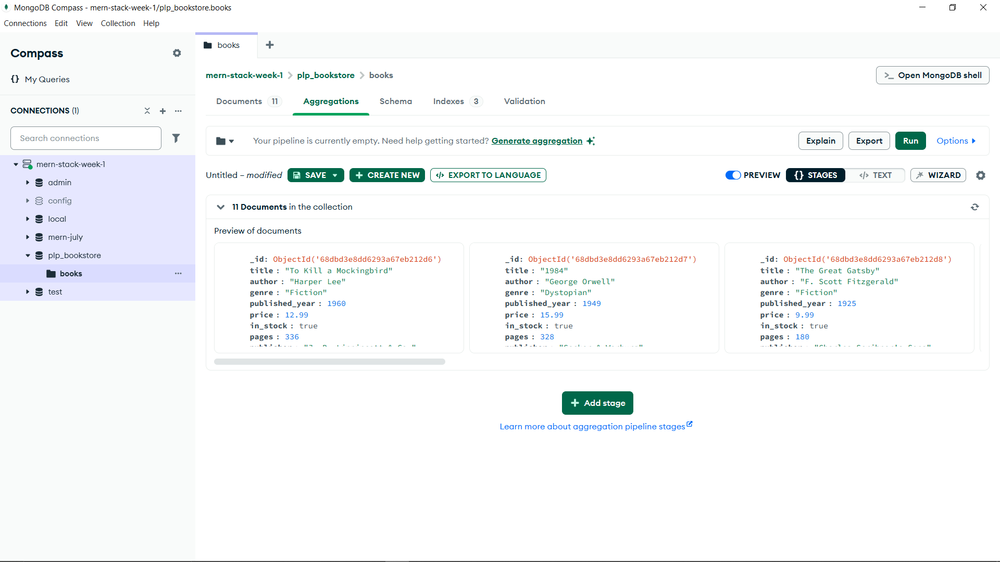
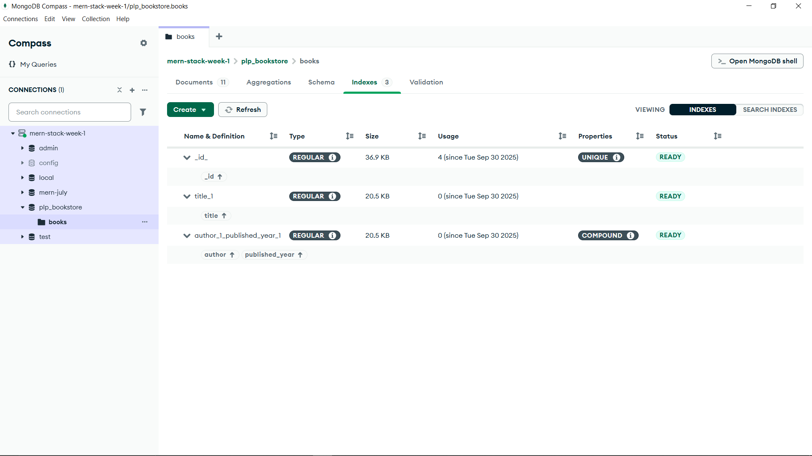

# MongoDB Bookstore Assignment

## Setup

1. Install **Node.js** and **MongoDB Community Edition** (or use MongoDB Atlas).
2. Install project dependencies:
   ```bash
   npm install
   ```
3. Create a `.env` file in the project root and add your MongoDB connection string:
   ```env
   MONGODB_URI=mongodb:<your_connection_string>
   ```
   (Replace with your Atlas URI if using MongoDB Atlas)
4. (Optional) Run `setup_db.js` to create the database and collection:
   ```bash
   node setup_db.js
   ```
5. Run `insert_books.js` to populate the database:
   ```bash
   node insert_books.js
   ```
6. Use `queries.js` in mongosh or Compass to run all required queries.

## Files

- `Week1-Assignment.md`: Assignment instructions
- `setup_db.js`: Creates the database and collection
- `insert_books.js`: Inserts sample book data
- `queries.js`: All required MongoDB queries (CRUD, advanced, aggregation, indexing)

## Requirements

- Node.js
- MongoDB (local or Atlas)
- MongoDB Shell (mongosh) or Compass

## Submission

Below are screenshots from MongoDB Compass showing the `plp_bookstore` database and `books` collection with sample data:





## Resources

- [MongoDB Documentation](https://docs.mongodb.com/)
- [MongoDB Node.js Driver](https://mongodb.github.io/node-mongodb-native/)
